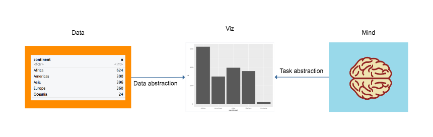

```{r setup, include=FALSE}
knitr::opts_chunk$set(echo = TRUE)
```

```{r}
library(tidyverse)
library(gapminder)
```

All inspired heavily by [Tamara Munzner](http://www.cs.ubc.ca/~tmm/), and also by the design of [ggplot2](http://ggplot2.org/), an R package for data visualization.

## Whence data visualization??



### Data abstraction: building the graph from the properties/constraints of the data

Two components:

* Mapping the variables in the data onto the aesthetic properties of the visualization
  * e.g. x-coordinate, y-coordinate, color, transparency, size...
* Defining the geometric objects that will represent each row of data.
  * e.g. point, bar, line...

### Task abstraction: building the graph from the properties/constraints of the viewer

* Deciding what the viewer's tasks are.
  * comparing, ranking, viewing relationships, viewing distributions, finding outliers... 
* Accounting for the viewer's perceptual abilities.
  * noticing differences in length, width, area, position, color, angle...

```{r cars}
gapminder
```


```{r echo=FALSE}
(count_data <- gapminder %>% 
  group_by(continent) %>% 
  count())

ggplot(count_data) +
  geom_point(mapping = aes(x = continent, y = n))

ggplot(count_data) +
  geom_bar(mapping = aes(x = continent, y = n), stat = "identity")

ggplot(count_data) +
  geom_bar(mapping = aes(x = forcats::fct_reorder(continent, desc(n)), y = n), stat = "identity")
```

```{r}
ggplot(data = gapminder) +
  geom_point(mapping = aes(x = gdpPercap, y = lifeExp))

ggplot(data = gapminder) +
  geom_point(mapping = aes(x = gdpPercap, y = lifeExp), alpha = 0.2)

ggplot(data = gapminder) +
  geom_point(mapping = aes(x = log(gdpPercap), y = lifeExp), alpha = 0.2)

ggplot(data = gapminder) +
  geom_point(mapping = aes(x = log(gdpPercap), color = continent, y = lifeExp), alpha = 0.2)

ggplot(data = gapminder) +
  geom_point(mapping = aes(x = log(gdpPercap), color = continent, y = lifeExp), alpha = 0.2) +
  facet_wrap(~continent)
```