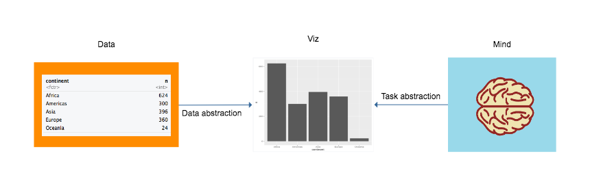
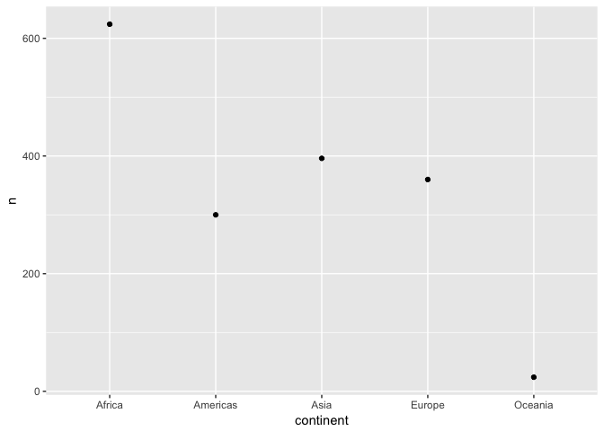
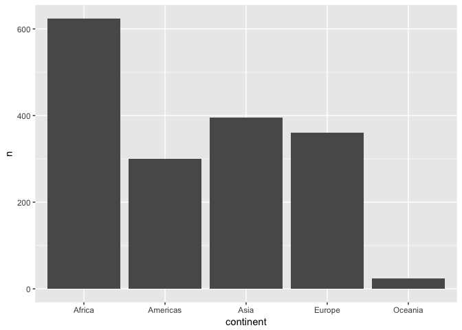
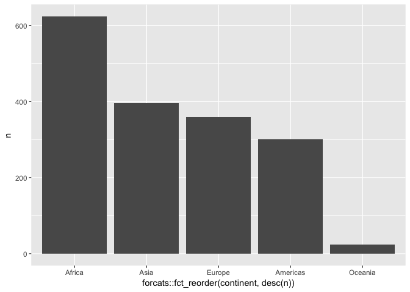
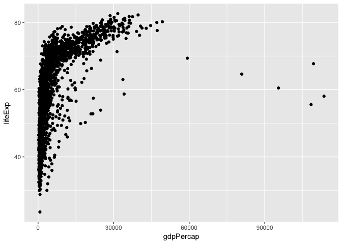
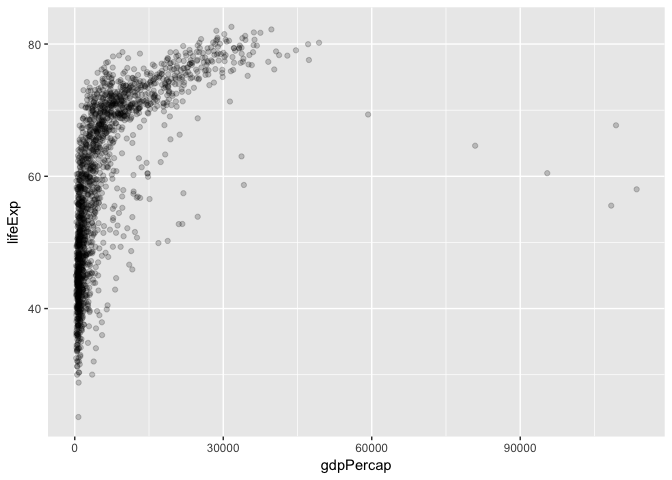
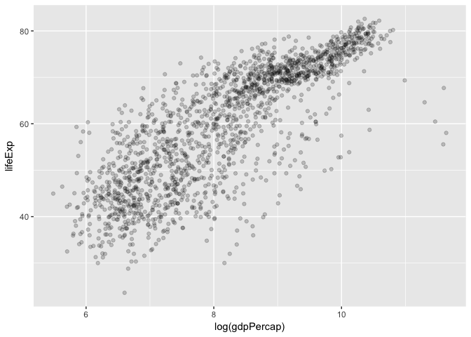
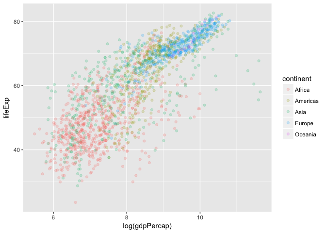
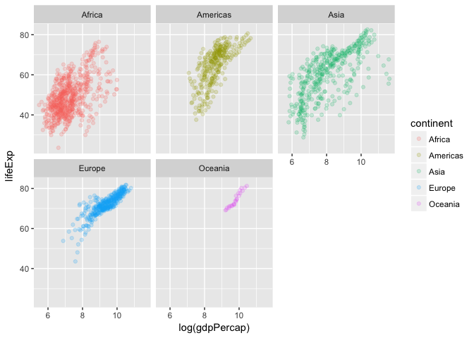

Examples
================

``` r
library(tidyverse)
```

    ## Loading tidyverse: ggplot2
    ## Loading tidyverse: tibble
    ## Loading tidyverse: tidyr
    ## Loading tidyverse: readr
    ## Loading tidyverse: purrr
    ## Loading tidyverse: dplyr

    ## Warning: package 'dplyr' was built under R version 3.4.2

    ## Conflicts with tidy packages ----------------------------------------------

    ## filter(): dplyr, stats
    ## lag():    dplyr, stats

``` r
library(gapminder)
```

    ## Warning: package 'gapminder' was built under R version 3.4.2

All inspired heavily by [Tamara Munzner](http://www.cs.ubc.ca/~tmm/), and also by the design of [ggplot2](http://ggplot2.org/), an R package for data visualization.

Why data visualization??
------------------------



### Data abstraction: building the graph from the properties/constraints of the data

Two components:

-   Mapping the variables in the data onto the aesthetic properties of the visualization
-   e.g. x-coordinate, y-coordinate, color, transparency, size...
-   Defining the geometric objects that will represent each row of data.
-   e.g. point, bar, line...

### Task abstraction: building the graph from the properties/constraints of the viewer

-   Deciding what the viewer's tasks are.
-   comparing, ranking, viewing relationships, viewing distributions, finding outliers...
-   Accounting for the viewer's perceptual abilities.
-   noticing differences in length, width, area, position, color, angle...

``` r
gapminder
```

    ## # A tibble: 1,704 x 6
    ##        country continent  year lifeExp      pop gdpPercap
    ##         <fctr>    <fctr> <int>   <dbl>    <int>     <dbl>
    ##  1 Afghanistan      Asia  1952  28.801  8425333  779.4453
    ##  2 Afghanistan      Asia  1957  30.332  9240934  820.8530
    ##  3 Afghanistan      Asia  1962  31.997 10267083  853.1007
    ##  4 Afghanistan      Asia  1967  34.020 11537966  836.1971
    ##  5 Afghanistan      Asia  1972  36.088 13079460  739.9811
    ##  6 Afghanistan      Asia  1977  38.438 14880372  786.1134
    ##  7 Afghanistan      Asia  1982  39.854 12881816  978.0114
    ##  8 Afghanistan      Asia  1987  40.822 13867957  852.3959
    ##  9 Afghanistan      Asia  1992  41.674 16317921  649.3414
    ## 10 Afghanistan      Asia  1997  41.763 22227415  635.3414
    ## # ... with 1,694 more rows

    ## # A tibble: 5 x 2
    ## # Groups:   continent [5]
    ##   continent     n
    ##      <fctr> <int>
    ## 1    Africa   624
    ## 2  Americas   300
    ## 3      Asia   396
    ## 4    Europe   360
    ## 5   Oceania    24



``` r
ggplot(data = gapminder) +
  geom_point(mapping = aes(x = gdpPercap, y = lifeExp))
```



``` r
ggplot(data = gapminder) +
  geom_point(mapping = aes(x = gdpPercap, y = lifeExp), alpha = 0.2)
```



``` r
ggplot(data = gapminder) +
  geom_point(mapping = aes(x = log(gdpPercap), y = lifeExp), alpha = 0.2)
```



``` r
ggplot(data = gapminder) +
  geom_point(mapping = aes(x = log(gdpPercap), color = continent, y = lifeExp), alpha = 0.2)
```



``` r
ggplot(data = gapminder) +
  geom_point(mapping = aes(x = log(gdpPercap), color = continent, y = lifeExp), alpha = 0.2) +
  facet_wrap(~continent)
```


